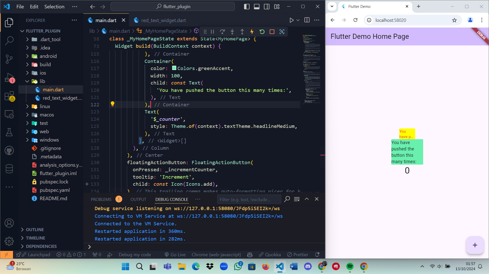

## Week 7

Halur Muhammad Abiyyu  
2141720072  

Hasil Praktikum  

 
Hasil Praktikum tersebut mendefinisikan sebuah widget Stateless bernama RedTextWidget, yang menggunakan plugin auto_size_text untuk menampilkan teks dengan ukuran yang otomatis disesuaikan berdasarkan jumlah karakter. Widget ini menerima sebuah parameter teks (text) yang wajib diisi. Teks akan ditampilkan dengan warna merah dan ukuran font 14, serta dibatasi maksimal dua baris. Jika teksnya terlalu panjang, maka akan dipotong menggunakan elipsis (...) untuk memastikan tidak melebihi batas tampilan yang telah ditentukan.
 

### Tugas Praktikum 

2. Baris kode tersebut adalah menambahkan plugin auto_size_text ke dalam project flutter menggunakan terminal

 

3. Pada langkah 5 yaitu menambahkan parameter teks pada widget yang wajib diisi ketika mau dipanggil

 

4. Pada langkah 6, kode pada container pertama yaitu kode dengan pemanggilan widget red_text_widget yang sudah dibuat menggunakan plugin auto_size_text yang berfungsi menampilkan teks dengan ukuran yang otomatis disesuaikan berdasarkan jumlah karakter teksnya. sedangkan pada container kedua hanya menggunakan text biasa dan ukurannya tidak mengikuti berdasarkan jumlah karakternya.

 

5. - key: Digunakan untuk mengidentifikasi widget secara unik dan mengontrol bagaimana widget diganti dalam hirarki aplikasi.

    - textKey: Kunci khusus untuk widget teks di dalam AutoSizeText, memberikan kontrol lebih pada widget teks internal.

    - style: Mengatur gaya teks seperti warna, ukuran font, dan ketebalan font. Jika tidak diisi, gaya default akan digunakan.

    - minFontSize: Ukuran font terkecil yang bisa digunakan saat ukuran teks menyesuaikan secara otomatis.

    - maxFontSize: Ukuran font terbesar yang bisa digunakan saat ukuran teks menyesuaikan secara otomatis.

    - stepGranularity: Menentukan seberapa besar langkah perubahan ukuran font saat menyesuaikan teks.

    - presetFontSizes: Daftar ukuran font yang sudah ditentukan sebelumnya, diurutkan dari terbesar ke terkecil. Ini menggantikan minFontSize dan maxFontSize.

    - group: Menyinkronkan ukuran teks dari beberapa AutoSizeText agar memiliki ukuran yang sama di semua widget dalam grup.

    - textAlign: Menentukan perataan horizontal teks, seperti kiri, tengah, atau kanan.

    - textDirection: Menentukan arah teks, apakah dari kiri ke kanan atau kanan ke kiri. Ini mempengaruhi cara perataan teks seperti TextAlign.start dan TextAlign.end diterapkan.

    - locale: Menentukan bahasa dan format teks berdasarkan wilayah, penting untuk merender karakter Unicode yang berbeda.

    - softWrap: Menentukan apakah teks akan dipisahkan di titik-titik istirahat lembut (misalnya setelah spasi) untuk membuat baris baru.

    - wrapWords: Mengatur apakah kata-kata yang tidak muat dalam satu baris akan dipindahkan ke baris berikutnya.

    - overflow: Menentukan bagaimana menangani teks yang terlalu panjang, seperti memotong teks atau menampilkan tanda elipsis (...).

    - overflowReplacement: Widget pengganti yang akan ditampilkan jika teks melebihi batas dan tidak bisa ditampilkan seluruhnya.

    - textScaleFactor: Menentukan seberapa besar ukuran font secara relatif terhadap ukuran logis standar, sehingga mempengaruhi ukuran teks secara keseluruhan.

    - maxLines: Menentukan jumlah baris maksimum yang bisa ditampilkan oleh teks. Jika melebihi, teks akan disesuaikan sesuai pengaturan overflow.

    - semanticsLabel: Label alternatif untuk teks, digunakan untuk keperluan aksesibilitas seperti pembaca layar.
